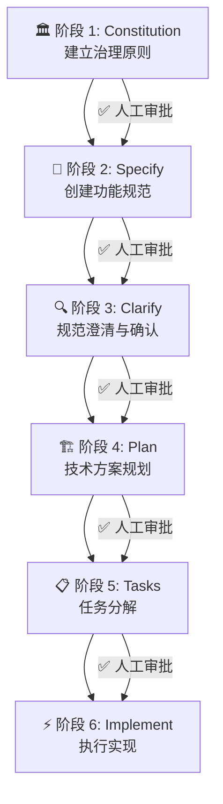

# 📜 SpecKit 项目定义宪章

> 基于 GitHub SpecKit「规范驱动开发 (Spec-Driven Development)」方法论的项目定义宪章模板。
> 本宪章是项目的**最高准则**，指导所有后续的规范制定、技术规划、任务拆分与代码实现。

---

## 目录

1. [宪章概述](#1-宪章概述)
2. [核心哲学](#2-核心哲学)
3. [项目元信息](#3-项目元信息)
4. [治理原则 (Constitution)](#4-治理原则-constitution)
5. [开发流程六阶段](#5-开发流程六阶段)
6. [产出物清单与目录结构](#6-产出物清单与目录结构)
7. [质量门禁与检查清单](#7-质量门禁与检查清单)
8. [宪章版本管理](#8-宪章版本管理)

---

## 1. 宪章概述

本宪章定义了使用 SpecKit 方法论进行项目开发时的**完整规则体系**。它相当于项目的「宪法」——所有 AI 代理和人类开发者在后续的规范编写、技术方案设计、任务拆解、代码实现等阶段，都必须遵守此宪章中的原则和约定。

### 适用范围

- 新项目从零创建
- 在现有项目中迭代新功能
- 遗留系统现代化改造

### 关键角色

| 角色 | 职责 |
|------|------|
| **产品负责人** | 定义"做什么"和"为什么"，审批规范文档 |
| **技术负责人** | 定义技术选型与架构，审批技术方案 |
| **AI 代理** | 生成规范、方案、任务、代码；必须遵守宪章 |
| **开发人员** | 审查 AI 产出物，执行人工干预检查点 |

---

## 2. 核心哲学

SpecKit 的核心理念是**规范驱动开发 (Spec-Driven Development, SDD)**，其颠覆传统开发流程的关键转变在于：

> **规范不再是脚手架，而是成为可执行的核心资产。**

### 四大基石

| 基石 | 说明 |
|------|------|
| **意图先行** | 先定义「做什么」和「为什么」，再决定「怎么做」 |
| **规范即源头** | 精确的、机器可理解的规范是整个开发过程的起点 |
| **多步细化** | 通过多阶段渐进式细化取代一次性的大型 prompt 生成 |
| **可追溯性** | 规范的变更自动向下传递到任务和实现，保持全链路一致 |

### 反模式（禁止）

- ❌ Vibe Coding（无规范的随意生成代码）
- ❌ 跳过人工审查直接让 AI 全自动实现
- ❌ 在规范阶段讨论技术栈细节
- ❌ 将规范视为"写完即弃"的一次性文档

---

## 3. 项目元信息

> 在使用本宪章时，填写以下项目基本信息。

```yaml
project_name: "[项目名称]"
project_description: "[项目一句话描述]"
version: "1.0.0"
created_date: "[创建日期]"
owner: "[项目负责人]"
team_members:
  - name: "[成员姓名]"
    role: "[角色]"
ai_agents:
  - "[使用的 AI 代理名称，如 GitHub Copilot / Claude Code / Gemini CLI]"
```

---

## 4. 治理原则 (Constitution)

治理原则是本宪章的核心组成部分，对应 SpecKit 工作流中的 `/constitution` 阶段。这些原则是**不可协商的**，AI 代理在每次生成计划或代码时都必须通过「宪法检查」。

### 4.1 架构原则

> 定义项目的架构方向和不可违背的技术决策。

```markdown
<!-- 根据项目实际情况填写，以下为示例 -->
- [ ] 所有功能必须作为独立模块/组件开发
- [ ] 采用 [架构模式，如：分层架构/微服务/MVC] 
- [ ] 前后端严格分离，通过 API 契约通信
- [ ] 所有外部依赖必须通过依赖注入管理
```

### 4.2 代码质量标准

```markdown
- [ ] 遵循 [编码规范名称] 代码风格
- [ ] 所有公共 API 必须包含文档注释
- [ ] 单个函数不超过 [N] 行
- [ ] 圈复杂度不超过 [N]
- [ ] 禁止在代码中硬编码 API 密钥或密码，必须使用环境变量
```

### 4.3 测试要求（不可协商）

```markdown
- [ ] 所有功能必须有对应的测试用例
- [ ] 测试覆盖率不低于 [N]%
- [ ] 采用 [TDD/BDD] 开发模式
- [ ] 测试框架：[框架名称]
- [ ] 所有 PR 必须通过 CI 测试才能合并
```

### 4.4 安全性要求

```markdown
- [ ] 所有用户输入必须经过验证和清洗
- [ ] 认证和授权遵循 [标准名称，如 OAuth 2.0]
- [ ] 敏感数据必须加密存储和传输
- [ ] 依赖项必须定期进行安全审计
```

### 4.5 性能与可访问性

```markdown
- [ ] 页面首次加载时间不超过 [N] 秒
- [ ] API 响应时间 P95 不超过 [N] ms
- [ ] 遵循 WCAG [版本] 无障碍标准
```

### 4.6 技术栈定义

```markdown
- 前端框架：[框架名称及版本]
- 后端框架：[框架名称及版本]
- 数据库：[数据库名称]
- 测试框架：[测试框架名称]
- 部署平台：[部署目标]
```

---

## 5. 开发流程六阶段

SpecKit 定义了一个严格的**六阶段流水线**，每个阶段之间设有**人工审批检查点**（Human-in-the-Loop），防止 AI 的失控自动化。



---

### 阶段 1：🏛️ Constitution — 建立治理原则

| 属性 | 说明 |
|------|------|
| **命令** | `/speckit.constitution` |
| **输入** | 项目的核心原则、质量标准、技术约束 |
| **输出** | `.specify/memory/constitution.md` |
| **审查要点** | 原则是否完整覆盖架构/质量/安全/性能维度 |

**关键规则**：
- Constitution 是所有后续阶段的根基
- AI 代理在生成任何产出物时必须引用并遵守 Constitution
- 修改 Constitution 需按版本管理规则进行

---

### 阶段 2：📝 Specify — 创建功能规范

| 属性 | 说明 |
|------|------|
| **命令** | `/speckit.specify` |
| **输入** | 高层需求描述：做什么 + 为什么（禁止涉及技术栈） |
| **输出** | `.specify/specs/<feature-id>/spec.md` |
| **审查要点** | 用户故事是否完整、验收标准是否可测量 |

**规范文档应包含**：
- 功能概述与目标
- 用户故事 (User Stories)
- 验收标准 (Acceptance Criteria)
- 用户旅程 (User Journeys)
- 关键实体与数据关系
- 约束条件与边界

> [!IMPORTANT]
> 此阶段**严禁**讨论技术栈、框架选型等"怎么做"的问题。专注于"做什么"和"为什么"。

---

### 阶段 3：🔍 Clarify — 规范澄清与确认

| 属性 | 说明 |
|------|------|
| **命令** | `/speckit.clarify` |
| **输入** | 已生成的规范文档 |
| **输出** | 更新后的 `spec.md`（新增 Clarifications 章节） |
| **审查要点** | 模糊需求是否已消解、边界条件是否已定义 |

**流程**：
1. 使用 `/speckit.clarify` 进行结构化提问
2. 如有需要，可用自由对话形式补充澄清
3. 逐条验证审查与验收清单 (Review & Acceptance Checklist)
4. **不要将 AI 的第一次尝试视为最终版**

---

### 阶段 4：🏗️ Plan — 技术方案规划

| 属性 | 说明 |
|------|------|
| **命令** | `/speckit.plan` |
| **输入** | 技术栈选型 + 架构偏好 + 特殊技术约束 |
| **输出** | 以下文档集（位于 `.specify/specs/<feature-id>/`） |

**产出物清单**：

| 文件 | 说明 |
|------|------|
| `plan.md` | 整体实现计划 |
| `research.md` | 技术调研与版本确认 |
| `data-model.md` | 数据模型设计 |
| `contracts/` | API 契约、接口规范 |
| `quickstart.md` | 快速启动指南 |

**审查检查项**：
- [ ] 技术选型是否与 Constitution 一致？
- [ ] 是否存在过度工程 (over-engineering)？
- [ ] 研究文档中的技术版本是否准确？
- [ ] 是否有被 AI 擅自添加的不必要组件？

---

### 阶段 5：📋 Tasks — 任务分解

| 属性 | 说明 |
|------|------|
| **命令** | `/speckit.tasks` |
| **输入** | 经审批的规范和技术方案 |
| **输出** | `.specify/specs/<feature-id>/tasks.md` |
| **审查要点** | 任务粒度是否合适、依赖关系是否正确 |

**任务文件特征**：
- 按用户故事分组，每个故事为一个实现阶段
- 任务按依赖关系排序
- 可并行执行的任务标记 `[P]`
- 每个任务包含精确的目标文件路径
- 包含检查点 (Checkpoint) 用于阶段性验证

---

### 阶段 6：⚡ Implement — 执行实现

| 属性 | 说明 |
|------|------|
| **命令** | `/speckit.implement` |
| **前置条件** | Constitution + Spec + Plan + Tasks 全部就绪且已审批 |
| **执行过程** | 按任务列表顺序执行，尊重依赖和并行标记 |
| **审查要点** | 运行时错误排查、浏览器控制台错误检查 |

**执行前验证**：
- [ ] 所有前置文档（宪章、规范、方案、任务）均已就绪
- [ ] 本地开发环境已安装所需工具
- [ ] 已创建特性分支

---

## 6. 产出物清单与目录结构

一个完整的 SpecKit 项目在经过全部阶段后，目录结构如下：

```
项目根目录/
├── .specify/
│   ├── memory/
│   │   └── constitution.md          # 🏛️ 治理原则文件
│   ├── scripts/
│   │   ├── check-prerequisites.sh   # 环境检查脚本
│   │   ├── common.sh                # 公共工具函数
│   │   ├── create-new-feature.sh    # 创建新功能脚本
│   │   ├── setup-plan.sh            # 技术方案初始化脚本
│   │   └── update-claude-md.sh      # AI 配置更新脚本
│   ├── specs/
│   │   └── <feature-id>/            # 按功能编号组织
│   │       ├── spec.md              # 📝 功能规范
│   │       ├── plan.md              # 🏗️ 实现计划
│   │       ├── research.md          # 🔬 技术调研
│   │       ├── data-model.md        # 📊 数据模型
│   │       ├── tasks.md             # 📋 任务分解
│   │       ├── quickstart.md        # 🚀 快速启动
│   │       └── contracts/           # 📄 接口契约
│   │           ├── api-spec.json
│   │           └── ...
│   └── templates/
│       ├── constitution-template.md # 宪章模板
│       ├── spec-template.md         # 规范模板
│       ├── plan-template.md         # 方案模板
│       └── tasks-template.md        # 任务模板
```

---

## 7. 质量门禁与检查清单

每个阶段必须通过以下门禁检查才能进入下一阶段：

### 阶段门禁总览

| 阶段 | 门禁条件 | 审批人 |
|------|----------|--------|
| Constitution → Specify | 原则完整、无遗漏维度 | 技术负责人 |
| Specify → Clarify | 用户故事完整、验收标准可测 | 产品负责人 |
| Clarify → Plan | 所有模糊需求已澄清 | 产品负责人 |
| Plan → Tasks | 技术方案可行、无过度工程 | 技术负责人 |
| Tasks → Implement | 任务粒度合适、依赖正确 | 技术负责人 |
| Implement → 交付 | 所有测试通过、无运行时错误 | 全团队 |

### 通用检查清单

- [ ] AI 产出物是否遵守了 Constitution？
- [ ] 是否存在 AI 擅自添加的不必要功能？
- [ ] 文档是否有前后矛盾之处？
- [ ] 变更是否已向下传播（规范→方案→任务→代码）？

---

## 8. 宪章版本管理

本宪章遵循**语义化版本** (Semantic Versioning)：

| 变更类型 | 版本变化 | 示例 |
|----------|----------|------|
| 核心原则变更 | MAJOR (`X.0.0`) | 架构模式从 MVC 切换为微服务 |
| 新增原则/规则 | MINOR (`x.Y.0`) | 新增无障碍要求 |
| 措辞修正/错别字 | PATCH (`x.y.Z`) | 修正错误的框架版本号 |

### 变更记录

| 版本 | 日期 | 变更说明 | 作者 |
|------|------|----------|------|
| 1.0.0 | [创建日期] | 初始版本 | [作者] |

---

> [!TIP]
> **使用建议**：将本宪章保存为项目根目录下的 `speckit-project-definition-charter.md`，在项目启动时由团队共同填写第 3、4 节中的占位内容，作为后续所有 SpecKit 工作流的基础输入。
