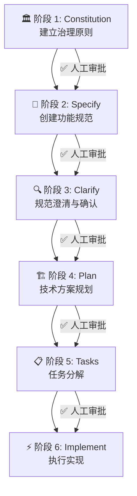

# 📜 Omni / Arca 软件开发宪章

> 基于 SpecKit「规范驱动开发 (Spec-Driven Development)」方法论
> 适用范围：Omni / Arca 多模态知识采集终端 — **软件部分**
> 版本：1.1.0 | 生效日期：2026-03-25

---

## 目录

1. [宪章概述](#1-宪章概述)
2. [核心哲学](#2-核心哲学)
3. [项目元信息](#3-项目元信息)
4. [产品范围与边界](#4-产品范围与边界)
5. [治理原则 (Constitution)](#5-治理原则-constitution)
6. [开发流程六阶段](#6-开发流程六阶段)
7. [产出物清单与目录结构](#7-产出物清单与目录结构)
8. [质量门禁与检查清单](#8-质量门禁与检查清单)
9. [宪章版本管理](#9-宪章版本管理)

---

## 1. 宪章概述

本宪章定义了 **Omni / Arca 多模态知识采集终端**（以下简称"本产品"）**软件部分**的完整开发规则体系。它是本产品软件线的「宪法」——所有 AI 代理和人类开发者在后续的规范编写、技术方案设计、任务拆解、代码实现等阶段，都必须遵守此宪章中的原则和约定。

### 1.1 产品愿景

> **AI 时代的个人记忆基础设施（Personal Mobile AI NAS）**
>
> 连接物理世界与数字大模型的"零摩擦单向阀"。将现实中的非结构化碎片（声音、板书、纸质书）瞬间转化为 AI 可读的高质量、结构化私有语料。

### 1.2 设计哲学

> **速度即正义，隐私即资产。**
>
> 通过消灭"整理的摩擦力"，让用户从"疲于奔命的信息拾荒者"进化为"从容的数字资产领主"。

### 1.3 适用范围

本宪章**仅覆盖软件部分**，包括：

- ✅ 桌面端应用（NoteCapt Desktop — macOS/Windows）
- ✅ 端侧 AI 结构化逻辑（Edge AI Librarian 的软件算法部分）
- ✅ 硬件与桌面端的通信协议与数据同步模块
- ✅ 大模型对接桥梁（LLM Bridge）

不包括：

- ❌ 硬件工业设计与制造
- ❌ PCB / 电路设计
- ❌ NPU 芯片选型与固件（归硬件宪章管辖）
- ❌ 硬件供应链与 BOM 成本

### 1.4 关键角色

| 角色 | 职责 |
|------|------|
| **产品负责人** | 定义"做什么"和"为什么"，审批功能规范文档 |
| **技术负责人** | 定义技术选型与架构，审批技术方案 |
| **AI 代理** | 生成规范、方案、任务、代码；必须遵守本宪章 |
| **开发人员** | 审查 AI 产出物，执行人工干预检查点 |
| **硬件团队代表** | 提供硬件接口规范，协调软硬件联调 |

---

## 2. 核心哲学

本项目遵循 SpecKit 的**规范驱动开发 (Spec-Driven Development, SDD)** 核心理念：

> **规范不再是脚手架，而是成为可执行的核心资产。**

### 2.1 四大基石

| 基石 | 说明 | 在本项目中的体现 |
|------|------|-----------------|
| **意图先行** | 先定义「做什么」和「为什么」，再决定「怎么做」 | 每个功能模块先写 spec 描述用户价值，再谈技术 |
| **规范即源头** | 精确的、机器可理解的规范是整个开发过程的起点 | 硬件接口协议 → 数据模型 → API 契约 → 代码实现 |
| **多步细化** | 通过多阶段渐进式细化取代一次性的大型 prompt 生成 | 六阶段流水线严格执行 |
| **可追溯性** | 规范的变更自动向下传递到任务和实现 | 接口变更 → 规范更新 → 任务调整 → 代码修改 |

### 2.2 反模式（禁止）

- ❌ **Vibe Coding** — 无规范的随意生成代码
- ❌ **跳过人工审查** — 直接让 AI 全自动实现功能
- ❌ **规范阶段讨论技术栈** — Specify 阶段严禁涉及框架、库的选择
- ❌ **写完即弃** — 规范文档不是一次性消耗品，是活文档
- ❌ **硬件假设** — 软件侧不得假设硬件行为，一切以接口协议文档为准

---

## 3. 项目元信息

```yaml
project_name: "Omni / Arca — 软件端"
project_description: "多模态知识采集终端的桌面控制中枢与 AI 结构化处理软件"
version: "1.0.0"
created_date: "2026-03-25"
owner: "钟嘉澄"
team_members:
  - name: "钟嘉澄"
    role: "产品负责人 / 技术负责人 / 开发人员"
ai_agents:
  - "Gemini CLI (Antigravity)"
  - "GitHub Copilot"
  - "Claude Code（备选）"

# 关联文档
related_charters:
  - "NCdesktop-项目开发宪章.md — 桌面端技术架构与编码规范"
  - "Liquid-Glass-UI-设计宪章.md — 视觉设计系统"
```

---

## 4. 产品范围与边界

### 4.1 软件功能模块全景

```
┌─────────────────────────────────────────────────────────────────┐
│               Omni / Arca 软件架构全景                           │
├─────────────────────────────────────────────────────────────────┤
│                                                                 │
│  ┌─── 桌面端 (NoteCapt Desktop) ────────────────────────────┐  │
│  │                                                           │  │
│  │  🎯 F4. 全局悬浮窗 (Global Dropzone)                     │  │
│  │  ├─ 拖拽入口（网页链接、截图、PDF 等）                     │  │
│  │  ├─ AI 自动分类、重命名、归档                              │  │
│  │  └─ 与 TF 卡双向同步                                     │  │
│  │                                                           │  │
│  │  🕰️ F5. 时空记忆轴布局 (Contextual Timeline) ★核心创新    │  │
│  │  ├─ X 轴：音频波形时间流（播放/拖拽定位）                  │  │
│  │  ├─ Y 轴：多模态数据"关键帧"吸附                          │  │
│  │  ├─ 由图寻音：点图跳音频                                  │  │
│  │  └─ 随音现图：播放到位自动弹图                             │  │
│  │                                                           │  │
│  │  🔗 F6. 大模型直连 (LLM Bridge)                          │  │
│  │  ├─ OpenAI API 直连（Chat / Embeddings / Whisper）        │  │
│  │  ├─ AI 智能摘要、问答、内容增强                            │  │
│  │  ├─ 一键导出至 NotebookLM（结构化 Markdown）              │  │
│  │  └─ "时间轴块"整体拖拽投喂                                │  │
│  │                                                           │  │
│  └───────────────────────────────────────────────────────────┘  │
│                         ↕ USB / Wi-Fi / TF 卡直读               │
│  ┌─── 端侧 AI 协同层 ──────────────────────────────────────┐  │
│  │                                                           │  │
│  │  🤖 F3. 端侧 AI 结构化 (Edge AI Librarian)               │  │
│  │  ├─ 内容主题识别算法                                      │  │
│  │  ├─ 自动打标 / 命名 / 分类逻辑                            │  │
│  │  └─ 结构化文件夹生成规则                                  │  │
│  │                                                           │  │
│  │  🎯 数据同步与通信协议                                    │  │
│  │  ├─ TF 卡文件系统读写协议                                 │  │
│  │  ├─ 实况知识包 (Live Knowledge Pack) 数据格式              │  │
│  │  └─ 增量同步算法                                          │  │
│  │                                                           │  │
│  └───────────────────────────────────────────────────────────┘  │
│                                                                 │
└─────────────────────────────────────────────────────────────────┘
```

### 4.2 软件与硬件的边界契约

| 维度 | 软件负责 | 硬件负责 |
|------|---------|---------|
| **拍照触发** | 接收并处理拍照事件和图片数据 | 物理按键触发、ISP 成像 |
| **扫描** | 解析扫描数据、OCR 后处理 | 扫描视窗硬件、原始光电信号 |
| **录音** | 音频编解码、波形可视化、时间戳对齐 | 麦克风阵列、声学前处理、降噪 |
| **实况录音** | 音频缓存管理策略、20s 截取算法 | 低功耗后台录音的硬件节能 |
| **端侧 AI** | 模型推理逻辑、分类规则、结构化输出 | NPU 算力调度、模型加载 |
| **存储** | 文件系统目录结构、数据格式定义 | TF 卡物理读写、坏块管理 |

### 4.3 目标用户画像

| 用户类型 | 核心痛点 | 软件侧核心价值 |
|---------|---------|--------------|
| **留学生 / 硬核学霸** | 听不懂专业课、录音与板书对不上 | 时空记忆轴实现音画精准同步 |
| **高阶知识工作者** | 极高隐私需求、极速捕获会议信息 | Default Offline + 本地结构化 |
| **信息收集极客** | 跨 App 切换之苦、资料"吃灰" | 全局悬浮窗 + AI 自动整理 |

---

## 5. 治理原则 (Constitution)

治理原则是本宪章的核心组成部分，对应 SpecKit 工作流中的 `/constitution` 阶段。这些原则是**不可协商的**，AI 代理在每次生成计划或代码时都必须通过「宪法检查」。

### 5.1 架构原则

```markdown
- [x] 桌面端采用 Tauri v2 架构（前端 React + 后端 Rust）
- [x] 所有功能必须作为独立模块/组件开发（参照 NCdesktop 目录结构规范）
- [x] 前后端严格分离，通过 Tauri IPC 命令通信
- [x] 端侧 AI 逻辑与桌面 UI 逻辑松耦合，通过数据格式协议对接
- [x] 所有外部依赖必须通过 Cargo.toml / package.json 声明
- [x] 音视频处理管线采用流式架构，避免一次性加载全量数据到内存
- [x] 时空记忆轴的渲染采用 Canvas/WebGL，不使用 DOM 堆叠
- [x] 数据存储采用混合策略：元数据用 SQLite，媒体文件用文件系统
- [x] 大模型调用统一使用 OpenAI 兼容接口（openai SDK），通过 Rust 后端代理转发
- [x] LLM 请求必须经过 Rust 后端 Proxy 层，前端不直接持有 API Key
```

### 5.2 代码质量标准

```markdown
- [x] 前端语言：TypeScript 严格模式（禁止 `any`）
- [x] 后端语言：Rust stable 通道
- [x] 遵循 NCdesktop 编码规范（命名、组件结构、IPC 通信等）
- [x] 所有公共 API 和 Tauri Command 必须包含文档注释
- [x] 单个函数不超过 50 行（辅助函数除外）
- [x] 圈复杂度不超过 10
- [x] 禁止在代码中硬编码 API 密钥或密码，必须使用环境变量
- [x] 所有代码注释和 commit 信息使用中文
```

### 5.3 测试要求（不可协商）

```markdown
- [x] 所有核心功能必须有对应的测试用例
- [x] 测试覆盖率不低于 75%
- [x] 前端测试框架：Vitest + React Testing Library
- [x] 后端测试框架：Rust 内置测试 + cargo test
- [x] 端到端测试框架：Tauri Driver（WebDriver 协议）
- [x] 时空记忆轴的音画同步精度测试：误差不超过 ±100ms
- [x] 所有 PR 必须通过 CI 测试才能合并
```

### 5.4 隐私与安全要求（产品红线）

> [!CAUTION]
> 隐私是本产品的**核心竞争力**，违反隐私原则等同于产品自杀。

```markdown
- [x] Default Offline：所有数据处理默认在本地完成
- [x] 任何云端通信必须经用户明确授权（Opt-in，非 Opt-out）
- [x] 用户原始数据（原始录音、原始照片）永远不上传至任何第三方服务器
- [x] LLM Bridge 双模式运行：
      - 模式 A（在线）：通过 OpenAI API 发送**结构化摘要/文本**，不发送原始媒体文件
      - 模式 B（离线导出）：生成本地结构化包，由用户手动投喂至 NotebookLM 等
- [x] OpenAI API Key 和 Endpoint 通过环境变量注入，禁止硬编码或写入配置文件
- [x] 所有 LLM API 请求/响应日志仅保留在本地，不外传
- [x] TF 卡上的数据支持 AES-256 加密存储
- [x] Tauri 权限最小化：只声明运行必需的 capabilities
- [x] IPC 命令参数必须做类型检查和边界验证
- [x] 所有外部链接在系统浏览器中打开，不在 WebView 内加载
```

### 5.5 性能目标

| 指标 | 目标值 | 说明 |
|------|--------|------|
| 冷启动时间 | < 500ms | Tauri 原生性能优势 |
| 内存占用（空闲） | < 80MB | 不含音频缓存 |
| 打包体积 | < 20MB | 含核心功能 |
| 时间轴渲染帧率 | 60fps | 拖拽、缩放操作 |
| 音频波形生成 | < 2s / 分钟音频 | 后台异步生成 |
| 音画同步跳转 | < 100ms | 点图跳音频的延迟 |
| AI 分类响应 | < 500ms / 文件 | 端侧推理或桌面端处理 |
| TF 卡扫描同步 | < 5s（100 个文件） | 增量同步 |
| 搜索响应 | < 200ms | 10,000 条笔记内 |
| LLM 首 Token 延迟 | < 2s | OpenAI API Streaming 首包 |
| LLM 摘要生成 | < 10s | 单篇笔记智能摘要 |

### 5.6 UI 设计约束

```markdown
- [x] 遵循 Liquid-Glass-UI-设计宪章.md 中的全部设计规范
- [x] 品牌主色海军蓝 #1F456E，强调色金色 #FFC000
- [x] macOS 优先，视觉风格与 Liquid Glass 系统语言统一
- [x] 时空记忆轴参照专业 DAW（如 Logic Pro）的剪辑轨道交互范式
- [x] 全局悬浮窗设计参照 macOS Dock / 废纸篓的直觉式交互
- [x] 支持亮色 / 暗色 / 跟随系统三种主题模式
```

### 5.7 技术栈定义

| 层级 | 技术选型 | 版本 |
|------|---------|------|
| **前端框架** | React + TypeScript | React 19 / TS 5.x |
| **构建工具** | Vite | 6.x |
| **样式方案** | Tailwind CSS + CSS 自定义属性 | v4 |
| **状态管理** | Zustand | latest |
| **桌面框架** | Tauri | v2 |
| **后端语言** | Rust | stable |
| **数据库** | SQLite (rusqlite / sea-orm) | — |
| **音频处理** | Web Audio API + Rust 音频解码 | — |
| **Canvas 渲染** | HTML5 Canvas / 可选 WebGL | — |
| **LLM 集成** | OpenAI SDK（openai npm 包） | latest |
| **LLM Rust 端** | async-openai (Rust crate) | latest |
| **图标库** | Lucide React | — |
| **虚拟列表** | @tanstack/react-virtual | — |
| **包管理器** | pnpm | — |
| **版本管理** | Git + Semantic Versioning | — |

### 5.8 OpenAI 大模型集成规范

> [!IMPORTANT]
> 所有大模型调用统一使用 **OpenAI 兼容接口**。用户已自备 API Endpoint 和 API Key。

#### 5.8.1 架构模式：Rust Proxy

```
┌─────────────────────────────────────────────────────────┐
│                  LLM 调用架构                            │
├─────────────────────────────────────────────────────────┤
│                                                         │
│  前端 (React)                                           │
│  ┌───────────────────────────────────────────────────┐  │
│  │  调用 Tauri IPC 命令                              │  │
│  │  invoke("llm_chat", { messages, stream: true })   │  │
│  │  invoke("llm_summarize", { content })             │  │
│  │  invoke("llm_classify", { fileData })             │  │
│  └────────────────────┬──────────────────────────────┘  │
│                       │ IPC                              │
│  Rust 后端 (Tauri)    ▼                                  │
│  ┌───────────────────────────────────────────────────┐  │
│  │  LLM Proxy 层 (src-tauri/src/llm/)               │  │
│  │  ├─ 从环境变量读取 OPENAI_API_KEY / BASE_URL     │  │
│  │  ├─ 构造 OpenAI 请求（Chat Completions API）      │  │
│  │  ├─ Streaming SSE 处理 → Tauri Event 推送前端     │  │
│  │  ├─ 错误处理 + 重试逻辑（指数退避）               │  │
│  │  └─ 请求/响应日志（仅本地存储）                   │  │
│  └────────────────────┬──────────────────────────────┘  │
│                       │ HTTPS                            │
│                       ▼                                  │
│              OpenAI 兼容 API Endpoint                    │
│              (用户自备，环境变量配置)                     │
│                                                         │
└─────────────────────────────────────────────────────────┘
```

**关键规则**：
- ✅ 前端**永远不直接**调用 OpenAI API，所有请求经 Rust 后端代理
- ✅ API Key 仅存在于 Rust 进程内存中，从环境变量 `OPENAI_API_KEY` 读取
- ✅ API Base URL 从环境变量 `OPENAI_BASE_URL` 读取，支持自定义 Endpoint
- ✅ Streaming 响应通过 Tauri Event 机制推送至前端，实现打字机效果

#### 5.8.2 环境变量规范

```bash
# .env（已加入 .gitignore，禁止提交）
OPENAI_API_KEY=sk-xxxxxxxxxxxxxxxxxxxxxxxx
OPENAI_BASE_URL=https://your-endpoint.example.com/v1
OPENAI_MODEL=gpt-4o                    # 默认模型
OPENAI_MAX_TOKENS=4096                 # 默认最大 Token 数
OPENAI_TEMPERATURE=0.7                 # 默认温度
```

**安全红线**：
- ❌ 禁止将 `.env` 文件提交到 Git
- ❌ 禁止在前端代码中引用 `OPENAI_API_KEY`
- ❌ 禁止在日志中打印完整的 API Key（最多显示前 8 位 `sk-xxxxx...`）
- ✅ 应用首次启动时检测环境变量是否配置，未配置则在 UI 中引导用户设置

#### 5.8.3 OpenAI API 使用场景

| 场景 | API 类型 | 模型建议 | 说明 |
|------|---------|---------|------|
| **智能笔记摘要** | Chat Completions | gpt-4o | 对时间轴会话生成结构化摘要 |
| **AI 自动分类** | Chat Completions | gpt-4o-mini | 文件内容分析与标签生成 |
| **内容问答** | Chat Completions (Streaming) | gpt-4o | 用户对笔记内容提问 |
| **OCR 后处理增强** | Chat Completions | gpt-4o | 修正 OCR 识别错误、格式化 |
| **录音转写** | Whisper API | whisper-1 | 音频转文字（可选增强功能） |
| **语义搜索** | Embeddings | text-embedding-3-small | 笔记向量化用于语义检索 |

#### 5.8.4 Rust 端 IPC 命令定义规范

```rust
// src-tauri/src/llm/commands.rs

use async_openai::{Client, config::OpenAIConfig};

/// 初始化 OpenAI 客户端（从环境变量读取配置）
fn create_client() -> Client<OpenAIConfig> {
    let config = OpenAIConfig::new()
        .with_api_key(std::env::var("OPENAI_API_KEY").expect("OPENAI_API_KEY 未设置"))
        .with_api_base(std::env::var("OPENAI_BASE_URL")
            .unwrap_or_else(|_| "https://api.openai.com/v1".to_string()));
    Client::with_config(config)
}

/// 智能摘要命令
#[tauri::command]
async fn llm_summarize(
    content: String,
    app_handle: tauri::AppHandle,
) -> Result<String, String> {
    // 1. 构造 system prompt + user content
    // 2. 调用 Chat Completions API
    // 3. 返回摘要结果
    todo!()
}

/// 流式对话命令（通过 Tauri Event 推送）
#[tauri::command]
async fn llm_chat_stream(
    messages: Vec<ChatMessage>,
    app_handle: tauri::AppHandle,
) -> Result<(), String> {
    // 1. 构造请求
    // 2. 开启 Streaming
    // 3. 逐 chunk 通过 app_handle.emit("llm-stream-chunk", chunk) 推送
    // 4. 完成后发送 app_handle.emit("llm-stream-done", ())
    todo!()
}
```

#### 5.8.5 前端 Streaming 消费规范

```typescript
// src/lib/ai/useLLMStream.ts

import { listen } from "@tauri-apps/api/event";
import { invoke } from "@tauri-apps/api/core";

/** 流式 LLM 对话 Hook */
export function useLLMStream() {
  const startStream = async (
    messages: ChatMessage[],
    onChunk: (text: string) => void,
    onDone: () => void,
    onError: (error: string) => void,
  ): Promise<void> => {
    const unlistenChunk = await listen<string>("llm-stream-chunk", (event) => {
      onChunk(event.payload);
    });
    const unlistenDone = await listen("llm-stream-done", () => {
      onDone();
      unlistenChunk();
      unlistenDone();
    });

    try {
      await invoke("llm_chat_stream", { messages });
    } catch (e) {
      onError(String(e));
      unlistenChunk();
      unlistenDone();
    }
  };

  return { startStream };
}
```

#### 5.8.6 错误处理与降级策略

```markdown
- [x] API Key 未配置 → UI 引导用户在设置页配置，LLM 功能灰置不可用
- [x] 网络不可达 → 自动降级为离线导出模式（模式 B），Toast 提示用户
- [x] API 返回 429 (Rate Limit) → 指数退避重试（最多 3 次，间隔 1s/2s/4s）
- [x] API 返回 401 (Unauthorized) → 提示用户检查 API Key 配置
- [x] API 返回 500+ → 记录错误日志，提示用户稍后重试
- [x] Streaming 中断 → 保留已接收的部分内容，提示用户可重新生成
- [x] 所有 LLM 功能在离线状态下优雅降级，不阻塞核心功能（笔记编辑、时间轴浏览）
```

---

## 6. 开发流程六阶段

SpecKit 定义了严格的**六阶段流水线**，每个阶段之间设有**人工审批检查点**（Human-in-the-Loop），防止 AI 的失控自动化。



---

### 阶段 1：🏛️ Constitution — 建立治理原则

| 属性 | 说明 |
|------|------|
| **输入** | 产品 PRD + 硬件接口文档 + 设计宪章 |
| **输出** | `.specify/memory/constitution.md` |
| **审查要点** | 原则是否完整覆盖架构/质量/隐私/性能维度 |

**本项目特殊规则**：
- Constitution 必须包含隐私红线条款
- 必须引用 `Liquid-Glass-UI-设计宪章.md` 作为 UI 子宪法
- 必须引用 `NCdesktop-项目开发宪章.md` 作为技术架构子宪法
- 硬件接口协议变更时，Constitution 须同步更新

---

### 阶段 2：📝 Specify — 创建功能规范

| 属性 | 说明 |
|------|------|
| **输入** | 高层需求描述：做什么 + 为什么（禁止涉及技术栈） |
| **输出** | `.specify/specs/<feature-id>/spec.md` |
| **审查要点** | 用户故事是否完整、验收标准是否可测量 |

**本产品功能编号体系**：

| 编号 | 功能模块 | 优先级 |
|------|---------|--------|
| F3 | 端侧 AI 结构化 (Edge AI Librarian) | P0 |
| F4 | 全局悬浮窗 (Global Dropzone) | P0 |
| F5 | 时空记忆轴布局 (Contextual Timeline) | P0 ★ |
| F6 | 大模型直连 — OpenAI API (LLM Bridge) | P1 |

**规范文档应包含**：
- 功能概述与用户价值
- 用户故事 (User Stories)
- 验收标准 (Acceptance Criteria) — 必须可度量
- 用户旅程 (User Journeys)
- 与硬件交互的数据流描述
- 关键实体与数据关系
- 约束条件与边界（含隐私约束）

> [!IMPORTANT]
> 此阶段**严禁**讨论技术栈、框架选型等"怎么做"的问题。专注于"做什么"和"为什么"。

---

### 阶段 3：🔍 Clarify — 规范澄清与确认

| 属性 | 说明 |
|------|------|
| **输入** | 已生成的规范文档 |
| **输出** | 更新后的 `spec.md`（新增 Clarifications 章节） |
| **审查要点** | 模糊需求是否已消解、硬件交互边界是否已定义 |

**本项目特殊澄清清单**：
- [ ] 时间戳对齐算法的精度要求是否明确？
- [ ] TF 卡文件格式和目录结构是否与硬件团队达成一致？
- [ ] "实况知识包"的数据封装格式是否已定义？
- [ ] AI 分类的标签体系是用户可自定义还是系统预设？
- [ ] LLM Bridge 的导出格式是否已确定（Markdown? JSON? OPML?）？
- [ ] OpenAI API 调用的 Prompt 模板是否已定义并版本化？
- [ ] 哪些场景使用 Streaming，哪些使用同步调用？
- [ ] 离线场景下的降级策略是否有明确定义？

---

### 阶段 4：🏗️ Plan — 技术方案规划

| 属性 | 说明 |
|------|------|
| **输入** | 技术栈选型 + 架构偏好 + 硬件接口文档 |
| **输出** | 以下文档集（位于 `.specify/specs/<feature-id>/`） |

**产出物清单**：

| 文件 | 说明 |
|------|------|
| `plan.md` | 整体实现计划 |
| `research.md` | 技术调研（音频处理库、Canvas 渲染方案等） |
| `data-model.md` | 数据模型设计 |
| `contracts/` | API 契约、IPC 命令接口、硬件通信协议 |
| `quickstart.md` | 快速启动指南 |

**审查检查项**：
- [ ] 技术选型是否与 Constitution 及两份子宪章一致？
- [ ] 是否存在过度工程 (over-engineering)？
- [ ] 音频处理方案是否满足 60fps 与 <100ms 跳转的性能目标？
- [ ] 数据同步方案是否支持增量同步？
- [ ] 是否考虑了离线故障恢复？
- [ ] OpenAI API Proxy 层的错误处理和重试策略是否合理？
- [ ] LLM Prompt 模板是否集中管理、版本化？

---

### 阶段 5：📋 Tasks — 任务分解

| 属性 | 说明 |
|------|------|
| **输入** | 经审批的规范和技术方案 |
| **输出** | `.specify/specs/<feature-id>/tasks.md` |
| **审查要点** | 任务粒度是否合适、依赖关系是否正确 |

**任务文件特征**：
- 按用户故事分组，每个故事为一个实现阶段
- 任务按依赖关系排序
- 可并行执行的任务标记 `[P]`
- 每个任务包含精确的目标文件路径
- 包含检查点 (Checkpoint) 用于阶段性验证
- 涉及硬件联调的任务额外标记 `[HW]`

---

### 阶段 6：⚡ Implement — 执行实现

| 属性 | 说明 |
|------|------|
| **前置条件** | Constitution + Spec + Plan + Tasks 全部就绪且已审批 |
| **执行过程** | 按任务列表顺序执行，尊重依赖和并行标记 |
| **审查要点** | 运行时错误排查、隐私合规检查、性能基准验证 |

**执行前验证**：
- [ ] 所有前置文档（宪章、规范、方案、任务）均已就绪
- [ ] 本地开发环境已按 NCdesktop 宪章初始化（Node.js + Rust + Tauri）
- [ ] 已创建特性分支（`feat/<feature-id>-<feature-name>`）
- [ ] 硬件接口 Mock 数据已准备（用于离线开发）

---

## 7. 产出物清单与目录结构

### 7.1 SpecKit 规范目录

```
项目根目录/
├── .specify/
│   ├── memory/
│   │   └── constitution.md           # 🏛️ 治理原则文件
│   ├── scripts/
│   │   ├── check-prerequisites.sh    # 环境检查脚本
│   │   ├── common.sh                 # 公共工具函数
│   │   ├── create-new-feature.sh     # 创建新功能脚本
│   │   ├── setup-plan.sh             # 技术方案初始化脚本
│   │   └── update-claude-md.sh       # AI 配置更新脚本
│   ├── specs/
│   │   ├── F3-edge-ai-librarian/     # 端侧 AI 结构化
│   │   │   ├── spec.md
│   │   │   ├── plan.md
│   │   │   ├── data-model.md
│   │   │   ├── tasks.md
│   │   │   └── contracts/
│   │   ├── F4-global-dropzone/       # 全局悬浮窗
│   │   │   └── ...
│   │   ├── F5-contextual-timeline/   # 时空记忆轴 ★
│   │   │   └── ...
│   │   └── F6-llm-bridge/            # 大模型直连
│   │       └── ...
│   └── templates/
│       ├── constitution-template.md
│       ├── spec-template.md
│       ├── plan-template.md
│       └── tasks-template.md
```

### 7.2 项目源码目录

> 遵循 `NCdesktop-项目开发宪章.md` 第三章定义的目录结构，在此基础上扩展：

```
NCdesktop/
├── src/
│   ├── components/
│   │   └── features/
│   │       ├── timeline/             # F5 时空记忆轴
│   │       │   ├── TimelineCanvas.tsx     # 波形/轨道 Canvas 渲染
│   │       │   ├── TimelineControls.tsx   # 播放/暂停/拖拽控件
│   │       │   ├── KeyframeMarker.tsx     # 关键帧（图片/扫描）标记
│   │       │   └── WaveformRenderer.tsx   # 音频波形渲染器
│   │       ├── dropzone/             # F4 全局悬浮窗
│   │       │   ├── GlobalDropzone.tsx     # 悬浮窗主组件
│   │       │   ├── DropzoneOverlay.tsx    # 拖拽覆盖层
│   │       │   └── FileProcessor.tsx      # 文件处理与分类
│   │       ├── bridge/               # F6 LLM Bridge
│   │       │   ├── ExportPanel.tsx        # 导出面板
│   │       │   ├── FormatSelector.tsx     # 格式选择器
│   │       │   ├── AIChatPanel.tsx        # AI 对话面板
│   │       │   ├── AISummaryView.tsx      # AI 摘要视图
│   │       │   └── LLMSettingsForm.tsx    # LLM 配置表单
│   │       └── sync/                  # 数据同步
│   │           ├── SyncStatus.tsx         # 同步状态指示
│   │           └── DeviceManager.tsx      # 设备管理
│   ├── stores/
│   │   ├── timelineStore.ts          # 时间轴状态
│   │   ├── dropzoneStore.ts          # 悬浮窗状态
│   │   ├── syncStore.ts              # 同步状态
│   │   ├── aiStore.ts                # AI 分类状态
│   │   └── llmStore.ts               # LLM 对话与配置状态
│   ├── lib/
│   │   ├── audio/                    # 音频处理工具
│   │   ├── sync/                     # 同步算法
│   │   └── ai/                       # AI 逻辑（前端部分）
│   │       ├── useLLMStream.ts       # Streaming 对话 Hook
│   │       └── promptTemplates.ts    # Prompt 模板管理
│   └── types/
│       ├── timeline.ts               # 时间轴相关类型
│       ├── knowledge-pack.ts         # 实况知识包类型
│       └── sync.ts                   # 同步相关类型
├── src-tauri/
│   └── src/
│       ├── commands/
│       │   ├── timeline.rs           # 时间轴 IPC 命令
│       │   ├── audio.rs              # 音频处理命令
│       │   ├── sync.rs               # 同步命令
│       │   ├── ai_classify.rs        # AI 分类命令
│       │   ├── llm.rs                # LLM 对话/摘要 IPC 命令
│       │   └── export.rs             # 导出命令
│       ├── models/
│       │   ├── knowledge_pack.rs     # 实况知识包模型
│       │   ├── timeline_entry.rs     # 时间轴条目
│       │   ├── classification.rs     # 分类结果
│       │   └── llm_types.rs          # LLM 请求/响应类型
│       ├── llm/                      # OpenAI API Proxy 层
│       │   ├── client.rs             # OpenAI 客户端初始化
│       │   ├── chat.rs               # Chat Completions 封装
│       │   ├── embeddings.rs         # Embeddings 封装
│       │   ├── whisper.rs            # Whisper 音频转写封装
│       │   ├── prompts.rs            # Prompt 模板（Rust 端）
│       │   └── retry.rs              # 重试与错误处理
│       ├── audio/                    # Rust 音频处理
│       │   ├── decoder.rs            # 音频解码
│       │   ├── waveform.rs           # 波形数据生成
│       │   └── timestamp.rs          # 时间戳服务
│       └── sync/                     # Rust 同步引擎
│           ├── tf_reader.rs          # TF 卡读取
│           ├── diff_engine.rs        # 增量差异计算
│           └── protocol.rs           # 通信协议
```

---

## 8. 质量门禁与检查清单

### 8.1 阶段门禁总览

| 阶段 | 门禁条件 | 审批人 |
|------|----------|--------|
| Constitution → Specify | 原则完整、隐私红线已覆盖 | 产品/技术负责人 |
| Specify → Clarify | 用户故事完整、验收标准可测 | 产品负责人 |
| Clarify → Plan | 所有模糊需求已澄清、硬件接口已确认 | 产品负责人 + 硬件代表 |
| Plan → Tasks | 技术方案可行、性能方案可实现 | 技术负责人 |
| Tasks → Implement | 任务粒度合适、依赖正确、HW 联调排期确认 | 技术负责人 |
| Implement → 交付 | 所有测试通过、性能基准达标、隐私审计通过 | 全团队 |

### 8.2 通用检查清单

```markdown
- [ ] AI 产出物是否遵守了 Constitution？
- [ ] AI 产出物是否遵守了隐私红线（无云端数据泄露）？
- [ ] 是否遵循了 Liquid Glass UI 设计宪章？
- [ ] 是否遵循了 NCdesktop 编码规范？
- [ ] 是否存在 AI 擅自添加的不必要功能？
- [ ] 文档是否有前后矛盾之处？
- [ ] 变更是否已向下传播（规范 → 方案 → 任务 → 代码）？
- [ ] 性能是否满足第 5.5 节的目标值？
```

### 8.3 核心功能专项检查

#### F5 时空记忆轴 — 专项质量门

```markdown
- [ ] 音画同步精度 ≤ ±100ms?
- [ ] 时间轴拖拽操作 60fps 无卡顿？
- [ ] 1 小时音频的波形渲染在 2 分钟内完成？
- [ ] "由图寻音" 跳转延迟 < 100ms？
- [ ] "随音现图" 高亮弹出动效是否符合 Liquid Glass 动效规范？
- [ ] 极端情况：3 小时录音 + 200 张图片是否仍可流畅操作？
```

#### F4 全局悬浮窗 — 专项质量门

```markdown
- [ ] 拖拽响应延迟 < 100ms？
- [ ] AI 自动分类准确率 > 85%（常见文件类型）？
- [ ] 悬浮窗是否支持 "收起 / 展开" 动效切换？
- [ ] 跨应用拖拽是否正常工作？
```

#### F6 LLM Bridge (OpenAI) — 专项质量门

```markdown
- [ ] API Key 未配置时，LLM 功能优雅灰置，不影响其他功能？
- [ ] 网络断开时，自动降级为离线导出模式？
- [ ] Streaming 打字机效果流畅、无闪烁？
- [ ] API 错误（401/429/500）是否有用户友好的提示？
- [ ] 指数退避重试策略是否正确实现？
- [ ] 发送至 OpenAI 的数据没有包含原始媒体文件（仅文本/摘要）？
- [ ] 环境变量配置流程是否有 UI 引导？
- [ ] Prompt 模板是否集中管理、可维护？
```

---

## 9. 宪章版本管理

本宪章遵循**语义化版本** (Semantic Versioning)：

| 变更类型 | 版本变化 | 示例 |
|----------|----------|------|
| 核心原则变更 | MAJOR (`X.0.0`) | 隐私策略从 Offline-first 改为 Cloud-first |
| 新增原则/规则 | MINOR (`x.Y.0`) | 新增 Windows 平台支持规则 |
| 措辞修正/错别字 | PATCH (`x.y.Z`) | 修正性能指标数值 |

### 变更记录

| 版本 | 日期 | 变更说明 | 作者 |
|------|------|----------|------|
| 1.0.0 | 2026-03-25 | 初始版本：基于 SpecKit 框架创建 | 钟嘉澄 |
| 1.1.0 | 2026-03-25 | 新增 OpenAI 大模型集成规范（5.8 节）；更新隐私条款、技术栈、目录结构 | 钟嘉澄 |

---

## 附录 A · 核心数据模型预览

> 完整数据模型在 Plan 阶段的 `data-model.md` 中定义，此处仅列出核心实体供宪法级参考。

```typescript
/** 实况知识包 — 硬件采集的最小语义单元 */
interface LiveKnowledgePack {
  id: string;                    // UUID
  captureTimestamp: string;      // ISO 8601，拍照/扫描的精确时刻
  type: "photo" | "scan" | "manual";
  
  // 核心数据
  imageData?: string;            // 图片路径
  scanText?: string;             // 扫描识别文本
  
  // 实况音频切片
  audioSlice?: {
    sourceAudioId: string;       // 关联的完整录音 ID
    startOffset: number;         // 相对录音起始的偏移（ms）
    endOffset: number;           // 结束偏移（ms）
    filePath: string;            // 切片文件路径
  };
  
  // 端侧 AI 结果
  aiClassification?: {
    topic: string;               // 主题
    tags: string[];              // 自动标签
    suggestedName: string;       // 建议文件名
    confidence: number;          // 置信度 0-1
  };
  
  createdAt: string;
  updatedAt: string;
}

/** 时间轴会话 — 一次连续的知识采集活动 */
interface TimelineSession {
  id: string;
  title: string;                 // 会话标题（AI 建议或用户自定义）
  startTime: string;             // 会话开始时间
  endTime: string;               // 会话结束时间
  
  audioRecording: {
    id: string;
    filePath: string;
    duration: number;            // 总时长（ms）
    waveformDataPath: string;    // 预计算的波形数据文件
  };
  
  keyframes: LiveKnowledgePack[];  // 按时间排序的关键帧列表
  
  folderId: string;
  tags: string[];
  isArchived: boolean;
}

/** OpenAI 对话消息 */
interface ChatMessage {
  role: "system" | "user" | "assistant";
  content: string;
}

/** LLM 配置（运行时状态，不持久化 API Key） */
interface LLMConfig {
  isConfigured: boolean;         // 环境变量是否已配置
  model: string;                 // 当前使用的模型
  maxTokens: number;             // 最大 Token 数
  temperature: number;           // 温度参数
  baseUrl: string;               // API Endpoint（脱敏显示）
}

/** LLM 请求记录（仅本地存储） */
interface LLMRequestLog {
  id: string;
  timestamp: string;
  type: "summarize" | "chat" | "classify" | "transcribe" | "embed";
  model: string;
  inputTokens: number;
  outputTokens: number;
  latencyMs: number;
  success: boolean;
  errorMessage?: string;
}
```

---

## 附录 B · 关联文档索引

| 文档 | 路径 | 说明 |
|------|------|------|
| 整体 PRD | `整体 prd.md` | 产品需求全文（含硬件+软件） |
| NCdesktop 项目开发宪章 | `NCdesktop-项目开发宪章.md` | 桌面端技术架构、编码规范、构建流程 |
| Liquid Glass UI 设计宪章 | `Liquid-Glass-UI-设计宪章.md` | 视觉设计系统、材质系统、组件规范 |
| SpecKit 宪章模板 | `speckit-project-definition-charter.md` | SpecKit 方法论宪章模板 |

---

## 附录 C · 此宪章的使用说明

本宪章是 Omni / Arca 软件线的权威开发指导文件。AI 助手在参与本项目开发时，应：

1. **首先加载** 本宪章，建立全局上下文
2. **交叉引用** NCdesktop 项目开发宪章（技术细节）和 Liquid Glass UI 设计宪章（视觉细节）
3. **严格执行** 六阶段流水线，不跳过任何阶段
4. **每次生成代码前** 进行宪法检查（隐私红线 → 架构原则 → 代码规范 → 性能目标）
5. **在涉及硬件交互时** 参照附录 A 的数据模型和第 4.2 节的边界契约
6. **保持** 中文注释和文档的一致性

> [!TIP]
> **开发顺序建议**：F3（端侧 AI 逻辑）→ F4（全局悬浮窗）→ F5（时空记忆轴）→ F6（LLM Bridge）。其中 F5 是产品核心差异化功能，应投入最多的设计和测试资源。
